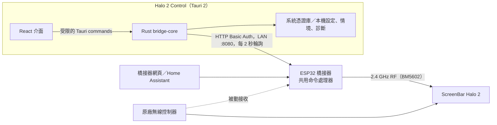

# Halo 2 Control App 設計簡報

給 Claude Design 使用的 App 介面設計輸入。內容依據 2026-09-27 的程式碼（`app/src/*.tsx`、`app/src-tauri/`、`protocol/v1/`）整理，描述現況與設計時不能違反的產品事實。

## 1. 產品概要

- **名稱**：Halo 2 Control（開發版 0.1.0，非 BenQ 官方軟體）。
- **用途**：在同一個區域網路內，透過自製 ESP32 橋接器控制 BenQ ScreenBar Halo 2 螢幕掛燈。
- **平台**：Windows（主要、已實機驗收）、macOS、iOS。桌面視窗預設 1050×780，最小 360×600。
- **使用者**：自己組裝橋接器的進階玩家，熟悉 IP、帳密等概念。他們主要想快速開關燈、調整亮度與色溫；遇到問題時需要可查的診斷資訊。
- **特色**：完全本機連線、沒有雲端帳號（現有頁尾標語：`LOCAL CONNECTION · NO CLOUD`）。

## 2. 系統架構

設計上要知道的幾點：

- App 只和橋接器通訊，**掛燈本身不會回報狀態**。橋接器只能確認「封包已送出」。
- 同一台燈可能同時被 App、橋接器網頁、Home Assistant 和原廠控制器操作。橋接器會收到原廠控制器的操作，App 會顯示這些操作。
- 狀態靠每 2 秒輪詢更新（沒有推播）。App 回到前景時會立即同步一次。
- 同一時間橋接器只處理一筆命令，每 500 ms 最多接受一筆。

## 3. 設計時不能違反的產品事實

1. **「已送出」不等於「燈已變化」。** 成功結果只能寫成「指令已送出」，而且要附帶說明掛燈沒有獨立確認。掛燈示意圖和「目前控制目標」都只代表目標值，不能設計成看起來像掛燈回報的即時狀態。
2. **三種數值要清楚分開：**
   - **目標（desired）**：橋接器記住的最新設定，來源可能是 App、網頁或原廠控制器。
   - **草稿（draft）**：使用者在滑桿上調整、尚未送出的值。
   - **原廠控制器最近操作（observed_remote）**：橋接器聽到的原廠控制器操作，附帶「約 N 秒前」。
3. **拖曳滑桿只修改草稿。** 使用者按「套用燈光設定」後才會發送，而且只送出改過的欄位；另有「取消調整」可以清除草稿。
4. **不會自動重送。** 命令結果不明（`UNKNOWN_OUTCOME`）時，介面要引導使用者按「查詢命令結果」，並禁止發送新命令。重新連線也不會重播舊命令。
5. **功能分成已驗證與實驗性。** 每項功能都標示為 `verified` 或 `experimental`。實驗性功能要先勾選「啟用實驗性控制（尚待實機驗證）」才能操作，未勾選時對應控制項停用。
6. **控制項什麼時候可以操作**：必須同時符合以下條件：
   - 已連線；
   - 無線模組和配對都就緒；
   - 電源功能是 verified；
   - 沒有處理中的命令；
   - 沒有結果不明的命令。

   任何一項不符合時，所有控制按鈕（包括系統匣）都要停用。設計應讓使用者看得出**為什麼**不能按。
7. **情境預設不包含電源**，也不會自動套用。選取情境只會把值帶入草稿。
8. **密碼處理**：密碼只存在系統憑證庫，使用已保存連線時不會回填到畫面。選取搜尋結果時要清除已輸入的密碼。

## 4. 畫面與元件清單

目前是單頁式介面：頂部列、左欄「橋接器」、右欄「燈光控制」，底下是錯誤區、診斷區和頁尾。寬度 700px 以下改為單欄。

### 4.1 頂部列
- 品牌標誌「HALO CONTROL」。
- 連線狀態徽章，有三種：尚未連線／橋接器已連線／連線中斷。

### 4.2 橋接器：未連線
- **搜尋區域網路橋接器**：按下後最多搜尋約 5 秒。結果最多 20 個候選，每個顯示名稱與 `host:port`。選取後只會填入位址，不會自動連線。找不到時顯示說明，並保留手動輸入。
- **已保存連線**：顯示 `host:port`，提供「使用已保存帳密連線」和「忘記已保存連線」。
- **手動表單**：IP 或主機名稱（預設 `screenbar-halo2.local`）、連接埠（預設 8080）、帳號、密碼。
- 「記住此連線與帳密」勾選框，附上憑證庫說明。
- 主要按鈕「連線橋接器 →」，連線時顯示「正在連線…」。
- 在瀏覽器中開啟時顯示提示：必須使用桌面或手機 App。

### 4.3 橋接器：已連線
- 裝置卡片，顯示：
  - 名稱與 `host:port`；
  - 無線模組狀態（就緒或其他）；
  - 配對是否已保存；
  - 最後同步時間。
- 動作：重新整理、中斷連線／更換裝置、忘記已保存連線。

### 4.4 燈光控制
- **掛燈示意圖**：開燈時呈現發光狀態。這只是目標值的示意。
- **目前控制目標**：開啟或關閉，加上模式（前燈／後燈／前後燈）。
- **電源**：「開燈」和「關燈」兩個按鈕，是明確的開與關，不是切換鍵。
- **燈光設定**（前後燈與色溫）：
  - 照明模式：前燈、後燈、前後燈。
  - 前燈亮度：1–100%。
  - 後燈亮度：1–100%。
  - 色溫：2700–6500 K，每格 25 K。
  - 「套用燈光設定」和「取消調整」按鈕。
- **情境預設**（可收合）：
  - 名稱最多 40 字，最多 20 組。
  - 列表每項顯示「名稱 · 模式 · 前 % · 後 % · K」，提供「帶入草稿」和「刪除」。
  - 沒有情境時顯示空狀態文字。
- **命令回饋區**：顯示處理中或最新結果，文案見第 5 節。
- **原廠控制器最近操作**：顯示開燈／關燈、模式、兩路亮度、色溫，以及「約 N 秒前」。

### 4.5 錯誤區
- 顯示錯誤訊息與錯誤代碼。
- 錯誤是 `UNKNOWN_OUTCOME` 時，附上說明和「查詢命令結果」按鈕。

### 4.6 診斷區（可收合，給進階使用者）
- **連線與命令診斷**：顯示 device_id、boot_id、無線模組狀態、最後命令的 JSON。
- **歷史診斷紀錄**：
  - 按鈕：讀取紀錄、匯出診斷 JSON、清除歷史紀錄。
  - 保留最近 200 筆，每筆顯示「時間 · 類型 · 狀態 · 錯誤碼 · TX 已送/計畫 · IRQ · FIFO」。
  - 匯出後顯示檔案路徑。iPhone 另外說明如何在「檔案」App 找到檔案。

### 4.7 系統匣（Windows）／選單列（macOS）
- 選單項目：開啟 Halo 2 Control、開燈、關燈、結束。
- 開燈和關燈的可用條件和主畫面相同。按下後會帶出主視窗，方便查看結果。
- iOS 沒有這項功能。

## 5. 狀態與文案對照

| 命令狀態 | 顯示文字 | 補充 |
| --- | --- | --- |
| accepted / executing | 處理中 | 期間所有控制停用 |
| transmitted | 指令已送出 | 「橋接器已完成發送；掛燈未提供獨立狀態確認。」 |
| failed | 發送失敗 | 顯示錯誤碼 |
| expired | 指令已過期 | |
| superseded | 指令已被新操作取代 | 通常是原廠控制器先操作了 |
| 其他 | 結果不明 | 引導查詢，不要重送 |

常見錯誤碼可以依使用者要做的事分組，設計時可為每組準備不同的呈現方式：

- **需要修正輸入**：`INVALID_HOST`、`INVALID_CREDENTIALS`、`UNAUTHORIZED`、`INVALID_VALUE`
- **連線問題**：`NETWORK`、`NOT_CONNECTED`、`DISCOVERY_UNAVAILABLE`
- **裝置狀態改變**：`BOOT_CHANGED`（橋接器重新開機）、`DEVICE_CHANGED`（位址指向了另一台橋接器）
- **稍後再試**：`RATE_LIMITED`、`BUSY`、`RADIO_UNAVAILABLE`
- **功能限制**：`EXPERIMENTAL_DISABLED`、`UNSUPPORTED_FIELD`、`PROTOCOL_ERROR`
- **需要特別處理**：`UNKNOWN_OUTCOME`

## 6. 平台差異

- **Windows**：第一次搜尋時會跳出防火牆權限提示，拒絕後搜尋結果會是空的。手動輸入 IP 必須一直可用。
- **macOS**：選單列捷徑；密碼存在 Keychain。
- **iOS**：
  - 會跳出區域網路權限提示；
  - 沒有系統匣；
  - 從背景返回時先同步狀態，不會自動送出背景前的操作；
  - 診斷檔可以在「檔案」App 找到；
  - 需要支援 360px 寬的直向單欄版面。

## 7. 現有視覺風格（參考用，可以重新設計）

- **色彩**：
  - 墨綠主色 `#2d4d3f`，文字色 `#263b34`；
  - 暖白背景 `#f4f5ef`；
  - 燈光暖黃 `#f7de86`／`#ffe6a1`；
  - 聚焦外框金色 `#b89b56`。
- **字體**：Inter、Segoe UI、Microsoft JhengHei（無襯線）。
- **標題語氣**：「讓光，剛剛好。」／`YOUR DESK, YOUR LIGHT`。
- **版面**：區塊用「01 橋接器」「02 燈光控制」編號，圓角 10px，700px 以下改為單欄，已支援 `prefers-reduced-motion`。
- **目前沒有深色模式**。桌燈常在夜間使用，建議設計深色主題。

## 8. 希望 Claude Design 處理的方向

1. **日常操作優先**：已保存連線的使用者一開 App，應該馬上看到電源和燈光控制。連線設定和診斷應退到次要位置。
2. **狀態層次**：在同一個畫面上，視覺上分開草稿、目標和原廠控制器操作，並讓「已送出、未經掛燈確認」的語意清楚但不嚇人。
3. **停用原因**：控制項停用時，說明原因（離線、處理中、結果不明、實驗性功能未啟用、無線模組未就緒）。
4. **響應式設計**：同時提供桌面（約 1050×780）和 iPhone（約 390 寬）兩種版面，另外設計系統匣選單。
5. **需要設計的狀態**：
   - 首次使用：沒有保存連線，需要搜尋或手動輸入；
   - 搜尋中；
   - 搜尋無結果；
   - 連線中；
   - 已連線且就緒；
   - 命令處理中；
   - 已送出；
   - 發送失敗；
   - 結果不明；
   - 連線中斷後自動恢復；
   - 橋接器重新開機；
   - 實驗性功能未啟用。
6. **文案語言**：使用繁體中文；技術代碼（例如錯誤碼、IRQ）保留英文，只在診斷區使用。

## 9. 不在範圍內

- SSE 即時推播（尚未實作，狀態仍以輪詢為主）。
- 多台橋接器同時管理（目前只支援一台）。
- 超音波人體感應設定（協定有欄位，但 App 沒有開放）。
- RF 配對與位址學習（在橋接器網頁操作，不在 App 內）。
